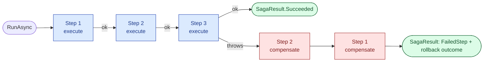

<p align="center">
  
</p>

# OrionSaga

[](https://github.com/tunahanaliozturk/OrionSaga/actions/workflows/ci-cd.yml)
[](https://www.nuget.org/packages/OrionSaga/)

In-process saga orchestration for .NET. Declare an ordered sequence of steps over a shared context;
if any step fails, OrionSaga automatically compensates the already-completed steps in reverse order,
so a multi-step operation either fully completes or cleanly unwinds.

Part of the **Orion** family. Usable entirely on its own.

---

## Why

Some operations touch several systems in a row: reserve stock, charge a card, book a courier. If the
courier booking fails, you must release the charge and the stock, in the right order, or you leave
money and inventory stranded. Writing that rollback by hand is error-prone. OrionSaga lets you
declare each step next to its compensation and runs the unwind for you when something breaks.

The whole library is one generic executor over your own context type, with no dependency beyond the
DI abstractions. There is no message broker, no database, and no background process to operate.

---

## How it works

A saga is an ordered list of steps. Each step has a forward action and an optional compensating
action that undoes it. `RunAsync` walks the steps in order over a single shared context. The first
step to throw stops forward progress; every step that already completed is then compensated in
reverse order, and a `SagaResult` reports exactly what happened.



Key invariant: the step that *failed* is not compensated (its forward action never completed). Only
the steps that fully completed are unwound.

---

## Install

```bash
dotnet add package OrionSaga
```

Targets `net8.0`, `net9.0`, and `net10.0`. The only runtime dependency is
`Microsoft.Extensions.DependencyInjection.Abstractions`.

---

## Quick start

Build a saga of steps, each pairing a forward action with its compensation, then run it over a
context instance:

```csharp
using Moongazing.OrionSaga.Orchestration;

var saga = new SagaBuilder<OrderContext>()
    .AddStep("reserve-stock",
        execute:    (ctx, ct) => inventory.ReserveAsync(ctx.OrderId, ct),
        compensate: (ctx, ct) => inventory.ReleaseAsync(ctx.OrderId, ct))
    .AddStep("charge-card",
        execute:    (ctx, ct) => payments.ChargeAsync(ctx.OrderId, ctx.Amount, ct),
        compensate: (ctx, ct) => payments.RefundAsync(ctx.OrderId, ct))
    .AddStep("book-courier",
        execute:    (ctx, ct) => courier.BookAsync(ctx.OrderId, ct),
        compensate: (ctx, ct) => courier.CancelAsync(ctx.OrderId, ct))
    .Build();

var result = await saga.RunAsync(context, ct);

if (!result.Succeeded)
{
    logger.LogWarning("Order saga failed at {Step}: {Error}",
        result.FailedStep, result.Failure!.Message);
}
```

If `charge-card` throws, OrionSaga compensates `reserve-stock` (the only completed step) and returns
a failure result. `charge-card` itself is not compensated, and `book-courier` never runs.

The shared context is yours; OrionSaga only threads it through. A minimal one:

```csharp
public sealed class OrderContext
{
    public required string OrderId { get; init; }
    public decimal Amount { get; init; }
}
```

---

## Usage

### Compensation on failure

When a step throws, rollback runs automatically and the result records the outcome. Inspect
`RolledBackCleanly` to know whether the unwind itself was clean:

```csharp
var result = await saga.RunAsync(context, ct);

if (!result.Succeeded)
{
    if (result.RolledBackCleanly)
    {
        // Failed, but every completed step compensated successfully. State is consistent.
        logger.LogWarning("Saga rolled back cleanly after {Step} failed", result.FailedStep);
    }
    else
    {
        // One or more compensations themselves threw: these effects may not be undone.
        foreach (var failure in result.CompensationFailures)
        {
            logger.LogError(failure.Exception,
                "Compensation for {Step} failed and needs manual attention", failure.StepName);
        }
    }
}
```

A compensation that throws is recorded in `CompensationFailures` and rollback continues for the
remaining steps, so one bad compensation does not strand the others.

### Steps without a compensation

The `compensate` argument is optional. A step with no real undo (for example a pure read or a step
that already commits atomically) is added with a forward action only:

```csharp
var saga = new SagaBuilder<OrderContext>()
    .AddStep("load-order", (ctx, ct) => orders.LoadAsync(ctx.OrderId, ct)) // no compensation
    .AddStep("charge-card",
        (ctx, ct) => payments.ChargeAsync(ctx.OrderId, ctx.Amount, ct),
        (ctx, ct) => payments.RefundAsync(ctx.OrderId, ct))
    .Build();
```

A missing compensation is treated as a no-op during rollback.

### Cancellation

`RunAsync` takes a `CancellationToken` that cancels *forward* progress. Rollback always runs with a
non-cancelled token, so a saga cancelled mid-flight still unwinds the work it already did:

```csharp
var result = await saga.RunAsync(context, cancellationToken);
// If the token is cancelled during a step, that step's OperationCanceledException
// fails the saga and the completed steps are still compensated.
```

### Observers

Attach an `ISagaObserver` to react to step completion, failure, and compensation, for logging or
alerting. The observer is observability only: any exception it throws is swallowed so it can never
disrupt orchestration or rollback.

```csharp
using Moongazing.OrionSaga.Observers;

public sealed class LoggingSagaObserver(ILogger<LoggingSagaObserver> logger) : ISagaObserver
{
    public void OnStepCompleted(string stepName) =>
        logger.LogInformation("Step {Step} completed", stepName);

    public void OnStepFailed(string stepName, Exception exception) =>
        logger.LogError(exception, "Step {Step} failed", stepName);

    public void OnCompensated(string stepName) =>
        logger.LogInformation("Step {Step} compensated", stepName);

    public void OnCompensationFailed(string stepName, Exception exception) =>
        logger.LogError(exception, "Compensation for {Step} failed", stepName);
}

var saga = new SagaBuilder<OrderContext>()
    .WithObserver(new LoggingSagaObserver(logger))
    .AddStep(/* ... */)
    .Build();
```

### Diagnostics

Attach a `SagaDiagnostics` instance to emit metrics. See [Telemetry](#telemetry) below.

---

## Results

`RunAsync` returns a `SagaResult`:

| Property | Meaning |
|----------|---------|
| `Succeeded` | True when every step completed. |
| `FailedStep` | The name of the step that threw, or null on success. |
| `Failure` | The exception that failed the saga, or null on success. |
| `CompensationFailures` | Compensations that themselves threw during rollback. Empty on success or a clean rollback. |
| `RolledBackCleanly` | True when the saga failed but every completed step compensated cleanly. |

Each entry in `CompensationFailures` is a `CompensationFailure(string StepName, Exception Exception)`
readonly record struct.

### Semantics

- Steps run in the order they are added, sharing one context instance.
- The first step to throw stops forward progress. The step that failed is **not** compensated; every
  step that completed is compensated in reverse order.
- A compensation that itself throws is recorded in `CompensationFailures` and rollback continues for
  the remaining steps.
- `RolledBackCleanly` is true when the saga failed but every compensation succeeded.
- Compensation runs with a non-cancelled token, so a saga cancelled mid-flight still unwinds.
- An empty saga succeeds.

---

## Configuration

`SagaBuilder<TContext>` is the single entry point. Every method returns the builder for chaining:

| Method | Purpose |
|--------|---------|
| `AddStep(name, execute, compensate?)` | Add a step from a name, a forward action, and an optional compensation. |
| `AddStep(SagaStep<TContext>)` | Add an already-constructed `SagaStep<TContext>`. |
| `WithObserver(ISagaObserver)` | Attach an observer for progress notifications. |
| `WithDiagnostics(SagaDiagnostics)` | Attach the metrics meter. |
| `Build()` | Snapshot the steps and produce a runnable `Saga<TContext>`. |

`Build()` snapshots the current steps into an array, so a built saga is immutable and can be reused
across many `RunAsync` calls. `RunAsync` keeps no state on the saga between runs.

### DI registration

`AddOrionSaga()` registers the shared `SagaDiagnostics` as a singleton so it can be injected where
sagas are built:

```csharp
using Moongazing.OrionSaga;

builder.Services.AddOrionSaga();
```

Sagas themselves are constructed per definition with `SagaBuilder` rather than resolved from the
container, so the diagnostics singleton is the only thing registered.

---

## Telemetry

Build a saga with `.WithDiagnostics(...)` to emit metrics to the `Moongazing.OrionSaga` meter,
exposed as the `SagaDiagnostics.MeterName` constant. Three counters are published, each tagged with
an `outcome`:

| Instrument | Tag values | Counts |
|------------|------------|--------|
| `orionsaga.runs` | `succeeded` / `failed` | Saga runs. |
| `orionsaga.steps` | `completed` / `failed` | Step forward actions. |
| `orionsaga.compensations` | `compensated` / `failed` | Compensations run during rollback. |

Wire it up with the DI singleton and subscribe with OpenTelemetry by meter name:

```csharp
using Moongazing.OrionSaga.Diagnostics;

builder.Services.AddOrionSaga();

builder.Services.AddOpenTelemetry()
    .WithMetrics(metrics => metrics.AddMeter(SagaDiagnostics.MeterName));

// Where you build the saga:
var saga = new SagaBuilder<OrderContext>()
    .WithDiagnostics(diagnostics) // injected SagaDiagnostics
    .AddStep(/* ... */)
    .Build();
```

`SagaDiagnostics` owns the `Meter` and is `IDisposable`; the DI container disposes the singleton for
you. Use the observer hook for per-step logging and the meter for aggregate counts; they are
independent and can be used together or alone.

---

## Scope

OrionSaga is an in-process orchestrator: it coordinates the steps of one operation within a single
process. It is **not** a durable, persisted workflow engine. If the process dies mid-saga, the
in-flight run does not resume from where it stopped. For most "do these few things, undo on failure"
cases that is exactly enough, and it stays dependency-light. See [docs/FEATURES.md](docs/FEATURES.md)
for the full capability list and [docs/ROADMAP.md](docs/ROADMAP.md) for where it may go.

---

## Testing

The orchestrator is plain in-memory code, so testing a saga needs no harness, broker, or database:
build a saga over a test context, run it, and assert on the `SagaResult` and the context's recorded
effects. Because each step is just a delegate, a step that throws is the entire failure setup:

```csharp
var saga = new SagaBuilder<Ledger>()
    .AddStep("a",
        (c, _) => { c.Events.Add("do-a"); return Task.CompletedTask; },
        (c, _) => { c.Events.Add("undo-a"); return Task.CompletedTask; })
    .AddStep("b", (_, _) => throw new InvalidOperationException("boom"))
    .Build();

var result = await saga.RunAsync(new Ledger());

Assert.False(result.Succeeded);
Assert.Equal("b", result.FailedStep);
Assert.True(result.RolledBackCleanly);
```

The repository's own suite under `tests/Moongazing.OrionSaga.Tests` covers success ordering, reverse
compensation, the failing step not being compensated, compensation-failure isolation, the empty
saga, cancellation rollback, observer notifications and fault isolation, and DI registration.

---

## Benchmarks

A BenchmarkDotNet suite under `benchmarks/Moongazing.OrionSaga.Benchmarks` measures the orchestrator
hot paths: assembling a saga, running it forward, unwinding it on failure, and the overhead of the
optional observer and diagnostics hooks. Every step body completes synchronously, so the numbers
reflect orchestration cost alone, not I/O.

Numbers are intentionally not committed, since micro-benchmark figures are hardware- and
runtime-specific. Run the suite on your own machine:

```bash
dotnet run -c Release --project benchmarks/Moongazing.OrionSaga.Benchmarks
```

See [benchmarks.md](benchmarks.md) for the benchmark classes and how to run or filter them.

---

## Design

- Multi-targets `net8.0`, `net9.0`, `net10.0`.
- `TreatWarningsAsErrors`, latest analyzers, nullable enabled.
- The executor is generic over your context type and has no dependency beyond the DI abstractions.
- A built saga is immutable and safe to reuse across runs.

---

## Versioning

OrionSaga follows [Semantic Versioning](https://semver.org/spec/v2.0.0.html). The public surface is
`SagaBuilder<TContext>`, `Saga<TContext>`, `SagaStep<TContext>`, `SagaResult`, `CompensationFailure`,
`ISagaObserver`, `SagaDiagnostics`, and the `AddOrionSaga` extension. Breaking changes to that
surface come with a major version bump. See [CHANGELOG.md](CHANGELOG.md) for the release history.

The library is currently at **0.1.0**: the API is young and may still change ahead of a 1.0.

---

## More from the Orion family

OrionSaga is one of a set of standalone .NET libraries:

- [OrionGuard](https://github.com/tunahanaliozturk/OrionGuard) - guard clauses and validation ecosystem.
- [OrionAudit](https://github.com/tunahanaliozturk/OrionAudit) - automatic EF Core change-audit trail.
- [OrionKey](https://github.com/tunahanaliozturk/OrionKey) - source-generated strongly-typed IDs.
- [OrionLock](https://github.com/tunahanaliozturk/OrionLock) - distributed locking.
- [OrionPatch](https://github.com/tunahanaliozturk/OrionPatch) - transactional outbox for EF Core.

---

## Contributing

Issues and pull requests welcome. Please read [CONTRIBUTING.md](CONTRIBUTING.md) and the
[Code of Conduct](CODE_OF_CONDUCT.md) before opening one.

## License

This project is licensed under the [MIT License](LICENSE).

## Author

**Tunahan Ali Ozturk** - [GitHub](https://github.com/tunahanaliozturk)
</content>
</invoke>
