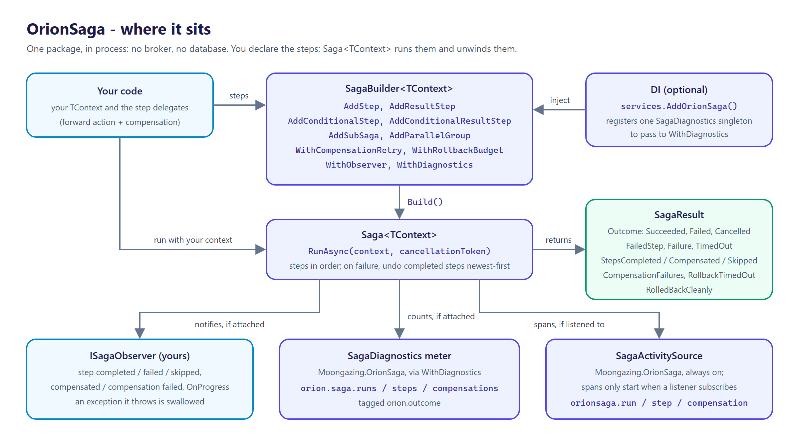
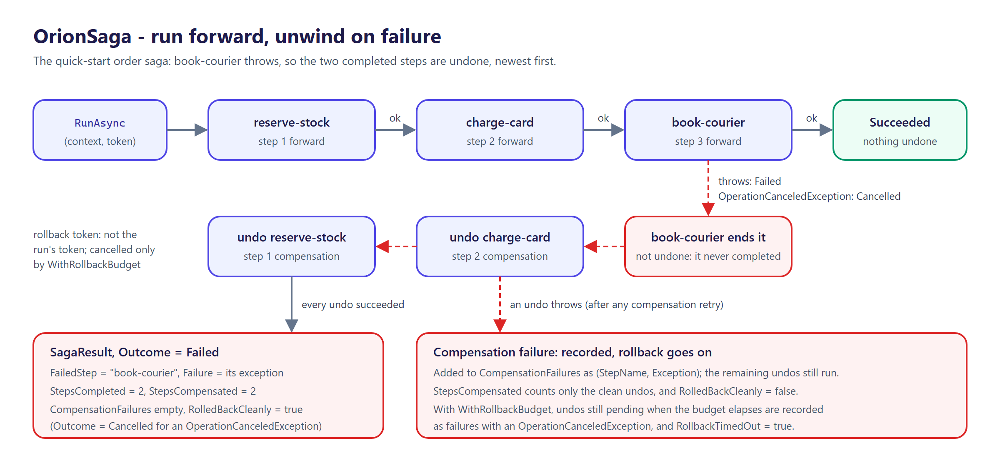
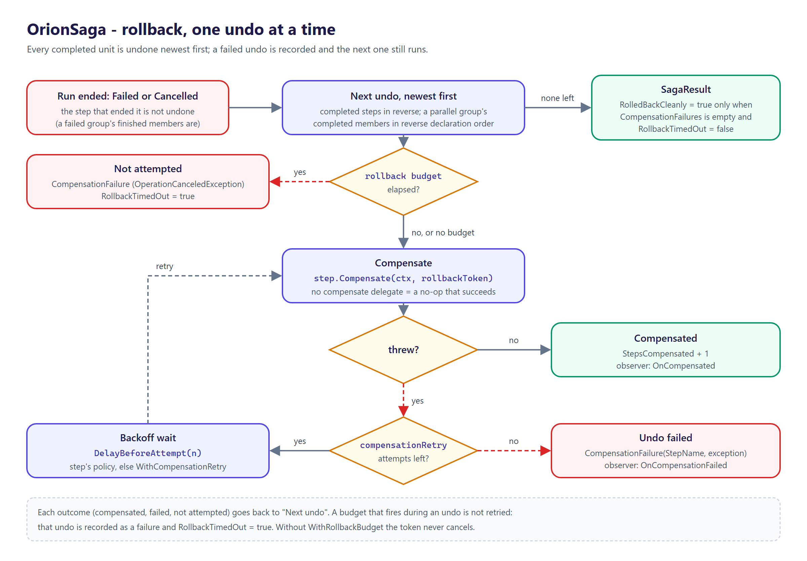
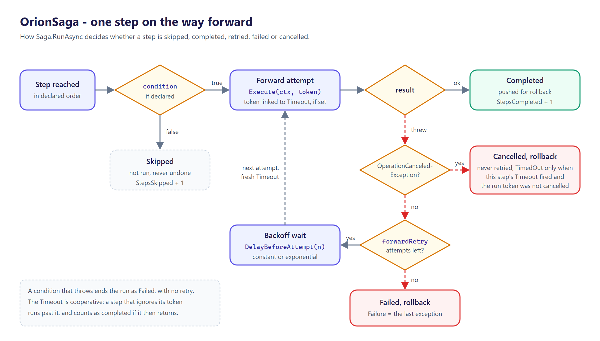

<p align="center">
  <picture>
    <source media="(prefers-color-scheme: dark)" srcset="docs/logo.png">
    
  </picture>
</p>

# OrionSaga

[](https://github.com/tunahanaliozturk/OrionSaga/actions/workflows/ci-cd.yml)
[](https://www.nuget.org/packages/OrionSaga/)
[](LICENSE)


In-process saga orchestration for .NET. Declare an ordered sequence of steps over a shared context;
if a step fails, OrionSaga compensates the already-completed steps in reverse order, so a multi-step
operation either completes or unwinds what it did, and the result tells you whether that unwind was
clean.

Part of the **Orion** family. Usable entirely on its own.



---

## Why

Some operations touch several systems in a row: reserve stock, charge a card, book a courier. If the
courier booking fails, you must release the charge and the stock, in the right order, or you leave
money and inventory stranded. Writing that rollback by hand is error-prone. OrionSaga lets you
declare each step next to its compensation and runs the unwind for you when something breaks.

The whole library is one generic executor over your own context type, with no dependency beyond the
DI abstractions and the family's shared `Orion.Abstractions` contracts spine. There is no message
broker, no database, and no background process to operate.

---

## How it works

A saga is an ordered list of steps. Each step has a forward action and an optional compensating
action that undoes it. `RunAsync` walks the steps in order over a single shared context. The first
step whose forward action throws (including an `OperationCanceledException` from cancellation or its
per-step timeout) stops forward progress; every step that already completed is then compensated in
reverse order, and a `SagaResult` reports what happened: whether the run succeeded, failed, or was
cancelled, and whether every compensation succeeded.



Key invariant: the step that *ended* the saga is not compensated (its forward action never
completed). Only the steps that fully completed are unwound.

---

## Install

```bash
dotnet add package OrionSaga
```

Targets `net8.0`, `net9.0`, and `net10.0`. The runtime dependencies are
`Microsoft.Extensions.DependencyInjection.Abstractions` and `Orion.Abstractions` (the family's
shared contracts spine, which supplies the `OrionInstrumentation` telemetry base). The quick start
below needs nothing else; the DI and OpenTelemetry samples further down run in a host
(`Microsoft.Extensions.Hosting` or ASP.NET Core) and use the `OpenTelemetry.Extensions.Hosting`
package.

---

## Quick start

A complete console program (`dotnet new console`, then replace `Program.cs`). Each step pairs a
forward action with its compensation; the third step throws, so the first two are undone:

```csharp
using Moongazing.OrionSaga.Orchestration;

var saga = new SagaBuilder<OrderContext>()
    .AddStep("reserve-stock",
        execute:    (order, ct) => Log($"reserve stock for {order.OrderId}"),
        compensate: (order, ct) => Log($"release stock for {order.OrderId}"))
    .AddStep("charge-card",
        execute:    (order, ct) => Log($"charge {order.Amount} for {order.OrderId}"),
        compensate: (order, ct) => Log($"refund {order.OrderId}"))
    .AddStep("book-courier",
        execute:    (order, ct) => throw new InvalidOperationException("no courier available"),
        compensate: (order, ct) => Log($"cancel courier for {order.OrderId}"))
    .Build();

SagaResult result = await saga.RunAsync(new OrderContext { OrderId = "order-42", Amount = 99.90m });

Console.WriteLine($"{result.Outcome} at {result.FailedStep}: {result.Failure?.Message}");
Console.WriteLine($"Compensated {result.StepsCompensated} step(s), clean rollback: {result.RolledBackCleanly}");

static Task Log(string message)
{
    Console.WriteLine(message);
    return Task.CompletedTask;
}

public sealed class OrderContext
{
    public required string OrderId { get; init; }
    public decimal Amount { get; init; }
}
```

Output:

```text
reserve stock for order-42
charge 99.90 for order-42
refund order-42
release stock for order-42
Failed at book-courier: no courier available
Compensated 2 step(s), clean rollback: True
```

`book-courier` itself is not compensated, because it never completed. The shared context is yours;
OrionSaga only threads it through every step and compensation.

The snippets below reuse `saga`, `result` and `OrderContext` from this program.

---

## Usage

### Compensation failures

When a step fails, rollback runs automatically and the result records the outcome. Inspect
`RolledBackCleanly` to know whether the unwind itself was clean:

```csharp
if (!result.Succeeded && !result.RolledBackCleanly)
{
    // One or more compensations threw (or the rollback budget ran out): these effects may not be undone.
    foreach (CompensationFailure failure in result.CompensationFailures)
    {
        Console.WriteLine($"Compensation for {failure.StepName} failed: {failure.Exception.Message}");
    }
}
```

A compensation that throws is recorded in `CompensationFailures` and rollback continues for the
remaining steps, so one bad compensation does not strand the others.



### Steps without a compensation

The `compensate` argument is optional. A step with nothing to undo (for example a pure read) is added
with a forward action only; during rollback it counts as a compensation that succeeded:

```csharp
var withRead = new SagaBuilder<OrderContext>()
    .AddStep("load-order", (order, ct) => Task.CompletedTask) // no compensation
    .AddStep("charge-card",
        (order, ct) => Task.CompletedTask,
        (order, ct) => Task.CompletedTask)
    .Build();
```

### Typed step results

A step's forward action can return a value, with an `apply` callback that writes it into the context
so the next step reads it directly instead of the step mutating shared state by hand:

```csharp
var typed = new SagaBuilder<Reservation>()
    .AddResultStep<string>("reserve-stock",
        execute:    (r, ct) => Task.FromResult($"res-{r.OrderId}"),
        apply:      (r, reservationId) => r.ReservationId = reservationId,
        compensate: (r, ct) => Task.CompletedTask)
    .AddStep("charge-card",
        (r, ct) => Task.CompletedTask) // reads r.ReservationId, which reserve-stock produced
    .Build();

public sealed class Reservation
{
    public required string OrderId { get; init; }
    public string? ReservationId { get; set; }
}
```

`apply` runs on the forward path immediately after the action; a fault it raises fails the step like
any other forward fault and triggers rollback. `AddResultStep` is an ergonomic layer over the untyped
step: ordering, compensation, timeouts, retries, and the `SagaResult` behave the same, and typed and
untyped steps mix freely in one saga. It is deliberately a distinct method rather than an `AddStep`
overload, so an existing `AddStep(name, forward, compensate)` call whose forward happens to return a
`Task<T>` can never rebind to it and lose its compensation.

### Cancellation

`RunAsync` takes a `CancellationToken` and hands it to every forward action (and to forward retry
backoff waits). Cancellation is cooperative: the executor does not check the token between steps, so
it takes effect when a step observes it and throws `OperationCanceledException`. Any
`OperationCanceledException` from a step is reported as `SagaOutcome.Cancelled`, distinct from a
business `Failed`. Compensations do not receive the run's token, so a saga cancelled mid-flight
still unwinds the work it already did:

```csharp
using var cts = new CancellationTokenSource(TimeSpan.FromSeconds(10));
var run = await saga.RunAsync(new OrderContext { OrderId = "order-43" }, cts.Token);

if (run.Cancelled)
{
    // A step threw OperationCanceledException. Completed steps were rolled back.
    Console.WriteLine($"Order saga cancelled at {run.FailedStep}");
}
```

`Cancelled` and `Failed` are mutually exclusive: a cancellation never sets `Failed`, and a forward
fault never sets `Cancelled`. The completed steps are compensated in both cases.

### Per-step timeouts

A step can declare a maximum forward-action duration with the `timeout` argument. The step's token is
linked to that deadline and to the run's token. When the deadline fires and the step stops by
throwing `OperationCanceledException`, the saga rolls back the completed steps and reports
`Cancelled` with `TimedOut` set to true:

```csharp
var timed = new SagaBuilder<OrderContext>()
    .AddStep("book-courier",
        execute:    (order, ct) => Task.Delay(TimeSpan.FromSeconds(5), ct), // honours its token
        compensate: (order, ct) => Task.CompletedTask,
        timeout:    TimeSpan.FromSeconds(2))
    .Build();

var slow = await timed.RunAsync(new OrderContext { OrderId = "order-44" });
Console.WriteLine($"TimedOut: {slow.TimedOut}, Failure: {slow.Failure?.GetType().Name}"); // True, SagaStepTimeoutException
```

The timeout is cooperative, not a hard kill: a step that ignores its token runs past the deadline,
and if it then returns normally it counts as completed. The budget must be strictly positive; a null
`timeout` (the default) means no budget. `TimedOut` is true only when the per-step deadline fired and
the run's token was not cancelled; a step that throws `OperationCanceledException` for another reason
(its own HttpClient timeout, a child token it cancels itself) is reported as `Cancelled` but not as
`TimedOut`.

### Retries

A step can retry a transient forward fault before the saga gives up on it, and a compensation can
retry before it is recorded as a failure. Both take a `RetryPolicy(maxAttempts, baseDelay, backoff)`
with `RetryBackoff.Constant` (the default) or `RetryBackoff.Exponential` (`baseDelay`, then doubling):

```csharp
var retrying = new SagaBuilder<OrderContext>()
    .WithCompensationRetry(new RetryPolicy(3, TimeSpan.FromMilliseconds(200))) // every compensation
    .AddStep("charge-card",
        execute:     (order, ct) => Task.CompletedTask,
        compensate:  (order, ct) => Task.CompletedTask,
        forwardRetry: new RetryPolicy(3, TimeSpan.FromMilliseconds(100), RetryBackoff.Exponential))
    .Build();
```

`maxAttempts` counts the first attempt, so `3` means up to two retries. An
`OperationCanceledException` (cancellation or a per-step timeout) is never retried, and a per-step
timeout bounds each attempt separately. A step's own `compensationRetry` overrides the saga-wide
`WithCompensationRetry` policy.

### Rollback budget

By default compensations get a token that never cancels, so a hung compensation can block the
rollback forever. `WithRollbackBudget` bounds the whole unwind: once the budget elapses the
compensation token is cancelled, the compensation that observes it and every compensation not yet
started are recorded in `CompensationFailures`, and `SagaResult.RollbackTimedOut` is true.

```csharp
var bounded = new SagaBuilder<OrderContext>()
    .WithRollbackBudget(TimeSpan.FromSeconds(30)) // must be positive; null clears it
    .AddStep("reserve-stock", (order, ct) => Task.CompletedTask, (order, ct) => Task.CompletedTask)
    .Build();
```

### Conditional steps, sub-sagas and parallel groups

```csharp
var composed = new SagaBuilder<OrderContext>()
    .AddConditionalStep("fraud-check",
        execute:   (order, ct) => Task.CompletedTask,
        condition: order => order.Amount > 1_000m) // false: skipped, never compensated
    .AddSubSaga("payment", payment => payment
        .AddStep("authorize", (order, ct) => Task.CompletedTask, (order, ct) => Task.CompletedTask)
        .AddStep("capture", (order, ct) => Task.CompletedTask, (order, ct) => Task.CompletedTask))
    .AddParallelGroup("notify", notify => notify
        .AddStep("email", (order, ct) => Task.CompletedTask)
        .AddStep("sms", (order, ct) => Task.CompletedTask))
    .Build();
```

- **Conditional steps** (`AddConditionalStep`, `AddConditionalResultStep`): the predicate runs against
  the context just before the step. When it returns false the step is skipped: not run, not
  compensated, counted in `SagaResult.StepsSkipped`, and reported through
  `ISagaObserver.OnStepSkipped`. A predicate that throws ends the run as `Failed` (no retry).
- **Sub-sagas** (`AddSubSaga`): the inner steps are flattened into the parent at that point, renamed
  `"{name}/{step}"` (`payment/authorize`), so they take part in the parent's single ordered run and
  single reverse rollback. Any observer or diagnostics set on the inner builder is ignored.
- **Parallel groups** (`AddParallelGroup`): the members start together and the group waits for all of
  them; the group occupies one step slot in the parent (members are named `"{name}/{member}"`). If a
  member fails, the group waits for the others to settle, the members that completed are compensated
  in reverse declaration order through the normal rollback, and the group's step name is the
  `FailedStep`. Members run against the shared context at the same time, so their actions must be
  safe to run concurrently. An optional group-level `condition` skips the whole group; a member's own
  condition skips just that member.

### Observers

Attach an `ISagaObserver` with `WithObserver` to react to step completion, failure, skips, and
compensation, for logging or alerting. The observer is observability only: any exception it throws
is swallowed so it can never disrupt orchestration or rollback.

```csharp
using Moongazing.OrionSaga.Observers;
using Moongazing.OrionSaga.Orchestration;

var observed = new SagaBuilder<OrderContext>()
    .WithObserver(new ConsoleSagaObserver())
    .AddStep("reserve-stock", (order, ct) => Task.CompletedTask, (order, ct) => Task.CompletedTask)
    .Build();

public sealed class ConsoleSagaObserver : ISagaObserver
{
    public void OnStepCompleted(string stepName) => Console.WriteLine($"{stepName} completed");

    public void OnStepFailed(string stepName, Exception exception) =>
        Console.WriteLine($"{stepName} failed: {exception.Message}");

    public void OnCompensated(string stepName) => Console.WriteLine($"{stepName} compensated");

    public void OnCompensationFailed(string stepName, Exception exception) =>
        Console.WriteLine($"compensation for {stepName} failed: {exception.Message}");

    // Optional richer overload: the step's one-based ordinal and the measured duration.
    public void OnStepCompleted(string stepName, int ordinal, TimeSpan duration) =>
        Console.WriteLine($"step {ordinal} {stepName} completed in {duration.TotalMilliseconds} ms");
}
```

The four name-only methods are required. Everything else is a default interface method you may
override: the ordinal-and-duration overloads of the four (they forward to the name-only methods),
`OnStepSkipped`, and `OnProgress(SagaRunSnapshot)`. `OnProgress` is called before each step and once
more after the last step of a successful run, with a read-only snapshot of the current step, the
completed steps, the pending steps, and `WouldCompensate` (the completed steps in unwind order). A
compensation notification carries the step's original forward ordinal. Parallel group members are
not reported on the forward path (the group slot is), but each member's compensation is. When no
observer is registered the executor captures no timing and builds no snapshot.

---

## Results

`RunAsync` returns a `SagaResult`:

| Property | Meaning |
|----------|---------|
| `Outcome` | The `SagaOutcome`: `Succeeded`, `Failed`, or `Cancelled`. |
| `Succeeded` | True when no step failed or was cancelled (skipped steps do not count against it). |
| `Failed` | True when a step's forward action (or its condition) threw an exception other than `OperationCanceledException`. |
| `Cancelled` | True when a step threw `OperationCanceledException`: the run's token, a per-step timeout, or any other cancellation the step raised. |
| `TimedOut` | True when that cancellation was the step's own per-step timeout firing (the run's token was not cancelled). Always false unless `Cancelled` is true. |
| `FailedStep` | The name of the step that ended the saga (the group name for a parallel group), or null on success. |
| `Failure` | The exception that ended the saga, or null on success. A timeout is a `SagaStepTimeoutException`. |
| `StepsCompleted` | How many step slots completed their forward action. A parallel group counts as one; the step that ended the saga is not counted. |
| `StepsSkipped` | How many steps or groups were skipped because their condition returned false. |
| `StepsCompensated` | How many compensations succeeded during rollback (each parallel group member counts). Zero on success. |
| `CompensationFailures` | Compensations that threw, or were cut short or never started because the rollback budget elapsed. Empty on success or a clean rollback. |
| `RollbackTimedOut` | True when the rollback budget elapsed before the unwind finished. |
| `RolledBackCleanly` | True when the saga did not succeed, `CompensationFailures` is empty, and `RollbackTimedOut` is false. |

Each entry in `CompensationFailures` is a `CompensationFailure(string StepName, Exception Exception)`
readonly record struct.

### Semantics

- Steps run in the order they are added, sharing one context instance.
- The first step whose forward action throws stops forward progress. That step is **not**
  compensated; every step that completed is compensated in reverse order.
- An `OperationCanceledException` yields `Outcome == Cancelled` (with `TimedOut` true only for a
  genuine per-step timeout); any other exception yields `Outcome == Failed`.
- A compensation that itself throws is recorded in `CompensationFailures` and rollback continues for
  the remaining steps.
- Compensations never see the run's token; their token is cancelled only by `WithRollbackBudget`.
- An empty saga succeeds.



---

## Configuration

`SagaBuilder<TContext>` is the single entry point. Every method returns the builder for chaining:

| Method | Purpose |
|--------|---------|
| `AddStep(name, execute, compensate?, timeout?, forwardRetry?, compensationRetry?)` | Add a step: a forward action, an optional compensation, an optional per-step timeout, and optional retry policies. |
| `AddStep(SagaStep<TContext>)` | Add an already-constructed `SagaStep<TContext>`. |
| `AddResultStep<TResult>(name, execute, apply, compensate?, timeout?, forwardRetry?, compensationRetry?)` | Add a step whose forward action returns a value; `apply` writes it into the context. |
| `AddConditionalStep(name, execute, condition, ...)` | `AddStep` plus a predicate; false skips the step. |
| `AddConditionalResultStep<TResult>(name, execute, apply, condition, ...)` | `AddResultStep` plus a predicate. |
| `AddSubSaga(name, configure)` | Flatten a named group of steps into this saga, each renamed `"{name}/{step}"`. |
| `AddParallelGroup(name, configure, condition?)` | Run the configured member steps concurrently as one step slot. |
| `WithCompensationRetry(RetryPolicy?)` | Saga-wide retry policy for every compensation (a step's own policy wins). |
| `WithRollbackBudget(TimeSpan?)` | Bound the whole rollback phase. |
| `WithObserver(ISagaObserver)` | Attach an observer for progress notifications. |
| `WithDiagnostics(SagaDiagnostics)` | Attach the metrics meter. |
| `Build()` | Copy the steps into an array and produce a runnable `Saga<TContext>`. |

`Build()` copies the current steps, so adding steps to the builder later does not change a built
saga, and a built saga can be run again and again. One caveat: a parallel group records which of its
members completed on the built saga, so do not run one built saga that contains a parallel group
from several threads at once; build one saga per concurrent run instead. Sagas without parallel
groups keep no state between runs.

### DI registration

`AddOrionSaga()` registers `SagaDiagnostics` as a singleton (with `TryAddSingleton`, so calling it
twice, or after your own registration, adds nothing). Sagas themselves are built per definition with
`SagaBuilder` rather than resolved from the container, so the diagnostics singleton is the only thing
registered. See [Telemetry](#telemetry) for a complete host sample.

---

## Telemetry

### Metrics

Build a saga with `.WithDiagnostics(...)` to emit metrics to the `Moongazing.OrionSaga` meter,
exposed as the `SagaDiagnostics.MeterName` constant. A saga built without `WithDiagnostics` records
no metrics. `Saga.RunAsync` records three counters, each tagged `orion.outcome`:

| Instrument | When `RunAsync` records it | `orion.outcome` |
|------------|----------------------------|-----------------|
| `orion.saga.runs` | Once per run, when it returns. | `succeeded`, or `failed` for both a failed and a cancelled run. |
| `orion.saga.steps` | Once per step slot that ran: after its forward action (with any retries) completes or ends the run. Skipped steps and retry attempts are not counted, and a parallel group counts once. | `completed` / `failed` (`failed` includes cancellations and timeouts). |
| `orion.saga.compensations` | Once per compensation during rollback, including each parallel group member and steps without a compensate delegate. | `compensated` / `failed` (`failed` includes undos cut short or skipped by the rollback budget). |

### Tracing

The executor always emits spans to the `ActivitySource` named `Moongazing.OrionSaga`
(`SagaActivitySource.Name`), with or without `WithDiagnostics`; a span is only created when a
listener subscribes to that source:

| Span | Tags |
|------|------|
| `orionsaga.run` | `orionsaga.outcome`: `succeeded`, `failed`, `cancelled`, `timedout` |
| `orionsaga.step` | `orionsaga.step.name`, `orionsaga.step.ordinal`, `orionsaga.outcome`: `completed`, `skipped`, `failed`, `cancelled`, `timedout` |
| `orionsaga.compensation` | `orionsaga.step.name`, `orionsaga.step.ordinal` (the forward ordinal), `orionsaga.outcome`: `compensated`, `failed`, `timedout` |

Step and compensation spans nest under the run span. A parallel group's member spans are
`orionsaga.step` spans nested under the group's step span and carry the name and outcome tags but no
ordinal.

### Wiring it up

A complete host (`dotnet new worker`, or the same lines in an ASP.NET Core app), with the
`OpenTelemetry.Extensions.Hosting` package plus an exporter of your choice:

```csharp
using Microsoft.Extensions.DependencyInjection;
using Microsoft.Extensions.Hosting;
using Moongazing.OrionSaga;
using Moongazing.OrionSaga.Diagnostics;
using Moongazing.OrionSaga.Orchestration;
using OpenTelemetry.Metrics;
using OpenTelemetry.Trace;

var builder = Host.CreateApplicationBuilder(args);

builder.Services.AddOrionSaga();
builder.Services.AddSingleton<OrderSagaFactory>();
builder.Services.AddOpenTelemetry()
    .WithMetrics(metrics => metrics.AddMeter(SagaDiagnostics.MeterName))
    .WithTracing(tracing => tracing.AddSource(SagaActivitySource.Name));

using var host = builder.Build();

var saga = host.Services.GetRequiredService<OrderSagaFactory>().Create();
var result = await saga.RunAsync(new OrderContext { OrderId = "order-42", Amount = 99.90m });

public sealed class OrderSagaFactory(SagaDiagnostics diagnostics)
{
    public Saga<OrderContext> Create() => new SagaBuilder<OrderContext>()
        .WithDiagnostics(diagnostics)
        .AddStep("reserve-stock", (order, ct) => Task.CompletedTask, (order, ct) => Task.CompletedTask)
        .Build();
}

public sealed class OrderContext
{
    public required string OrderId { get; init; }
    public decimal Amount { get; init; }
}
```

`SagaDiagnostics` owns its `Meter` and is `IDisposable`; when the container creates it, the container
disposes it. Use the observer hook for per-step logging and the meter and spans for aggregates and
traces; they are independent and can be used together or alone.

---

## Scope

OrionSaga is an in-process orchestrator: it coordinates the steps of one operation within a single
process. It is **not** a durable, persisted workflow engine. If the process dies mid-saga, the
in-flight run does not resume from where it stopped and its completed steps are not compensated. For
most "do these few things, undo on failure" cases that is enough, and it stays dependency-light. See
[docs/FEATURES.md](docs/FEATURES.md) for the full capability list and
[docs/ROADMAP.md](docs/ROADMAP.md) for where it may go.

---

## Testing

The orchestrator is plain in-memory code, so testing a saga needs no harness, broker, or database:
build a saga over a test context, run it, and assert on the `SagaResult` and the context's recorded
effects. Because each step is just a delegate, a step that throws is the entire failure setup
(xUnit shown):

```csharp
using Moongazing.OrionSaga.Orchestration;
using Xunit;

public sealed class OrderSagaTests
{
    [Fact]
    public async Task A_failing_step_rolls_back_the_completed_one()
    {
        var saga = new SagaBuilder<Ledger>()
            .AddStep("a",
                (c, _) => { c.Events.Add("do-a"); return Task.CompletedTask; },
                (c, _) => { c.Events.Add("undo-a"); return Task.CompletedTask; })
            .AddStep("b", (_, _) => throw new InvalidOperationException("boom"))
            .Build();

        var ledger = new Ledger();
        var result = await saga.RunAsync(ledger);

        Assert.True(result.Failed);
        Assert.Equal("b", result.FailedStep);
        Assert.True(result.RolledBackCleanly);
        Assert.Equal(new[] { "do-a", "undo-a" }, ledger.Events);
    }

    public sealed class Ledger
    {
        public List<string> Events { get; } = [];
    }
}
```

The repository's own suite under `tests/Moongazing.OrionSaga.Tests` covers ordering, reverse
compensation, compensation-failure isolation, cancellation and per-step timeouts, retries and the
rollback budget, typed, conditional, sub-saga and parallel steps, observer notifications and
snapshots, metrics, tracing, and DI registration. `tests/Moongazing.OrionSaga.AotSmoke` is published
with NativeAOT in CI. A runnable tour of the main scenarios lives in `demo/Moongazing.OrionSaga.Demo`.

---

## Benchmarks

A BenchmarkDotNet suite under `benchmarks/Moongazing.OrionSaga.Benchmarks` measures the orchestrator
hot paths: assembling a saga, running it forward, unwinding it on failure, and the overhead of the
optional observer and diagnostics hooks. Every step body completes synchronously, so the numbers
reflect orchestration cost alone, not I/O.

Numbers are intentionally not committed, since micro-benchmark figures are hardware- and
runtime-specific. Run the suite on your own machine:

```bash
dotnet run -c Release --project benchmarks/Moongazing.OrionSaga.Benchmarks
```

See [benchmarks.md](benchmarks.md) for the benchmark classes and how to run or filter them.

---

## Design

- Multi-targets `net8.0`, `net9.0`, `net10.0`.
- `TreatWarningsAsErrors`, `latest-recommended` analyzers, nullable enabled.
- The executor is generic over your context type; the runtime dependencies are the DI abstractions and `Orion.Abstractions` (the family's shared contracts spine).
- A built saga copies its steps and can be reused across runs (see the parallel group caveat under [Configuration](#configuration)).

---

## Versioning

OrionSaga follows [Semantic Versioning](https://semver.org/spec/v2.0.0.html). The public surface is
`SagaBuilder<TContext>`, `Saga<TContext>`, `SagaStep<TContext>`, `SagaResult`, `SagaOutcome`,
`CompensationFailure`, `RetryPolicy`, `RetryBackoff`, `SagaStepTimeoutException`, `SagaRunSnapshot`,
`StepReference`, `ISagaObserver`, `NullSagaObserver`, `SagaDiagnostics`, `SagaActivitySource`, and the
`AddOrionSaga` extension. Breaking changes to that surface come with a major version bump. See
[CHANGELOG.md](CHANGELOG.md) for the release history.

The library is currently at **0.7.0**: the API is young and may still change ahead of a 1.0.

---

## More from the Orion family

OrionSaga is one of a set of standalone .NET libraries:

- [OrionGuard](https://github.com/tunahanaliozturk/OrionGuard) - guard clauses and validation ecosystem.
- [OrionAudit](https://github.com/tunahanaliozturk/OrionAudit) - automatic EF Core change-audit trail.
- [OrionKey](https://github.com/tunahanaliozturk/OrionKey) - source-generated strongly-typed IDs.
- [OrionLock](https://github.com/tunahanaliozturk/OrionLock) - distributed locking.
- [OrionPatch](https://github.com/tunahanaliozturk/OrionPatch) - outbox for EF Core.

---

## Contributing

Issues and pull requests welcome. Please read [CONTRIBUTING.md](CONTRIBUTING.md) and the
[Code of Conduct](CODE_OF_CONDUCT.md) before opening one. Report security issues as described in
[SECURITY.md](SECURITY.md).

## License

This project is licensed under the [MIT License](LICENSE).

## Author

**Tunahan Ali Ozturk** - [GitHub](https://github.com/tunahanaliozturk)
